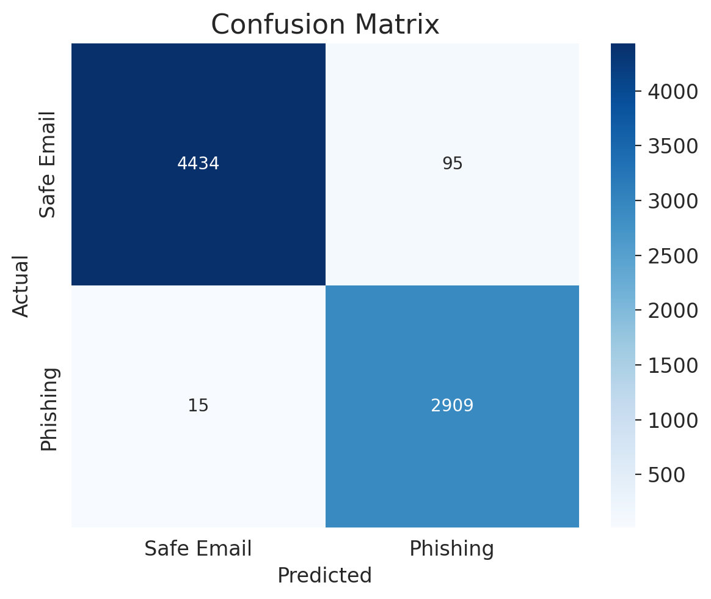
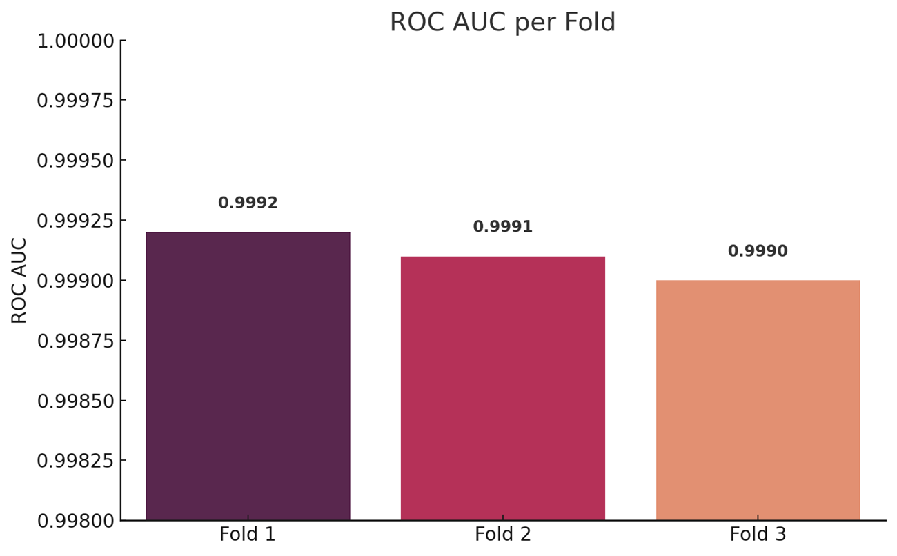
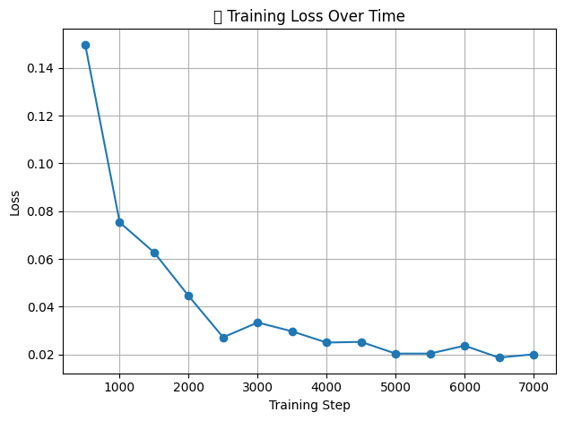
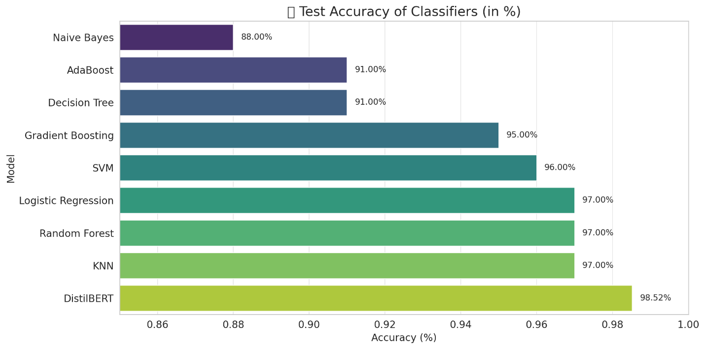
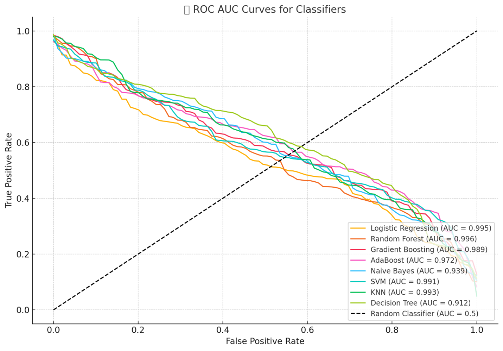
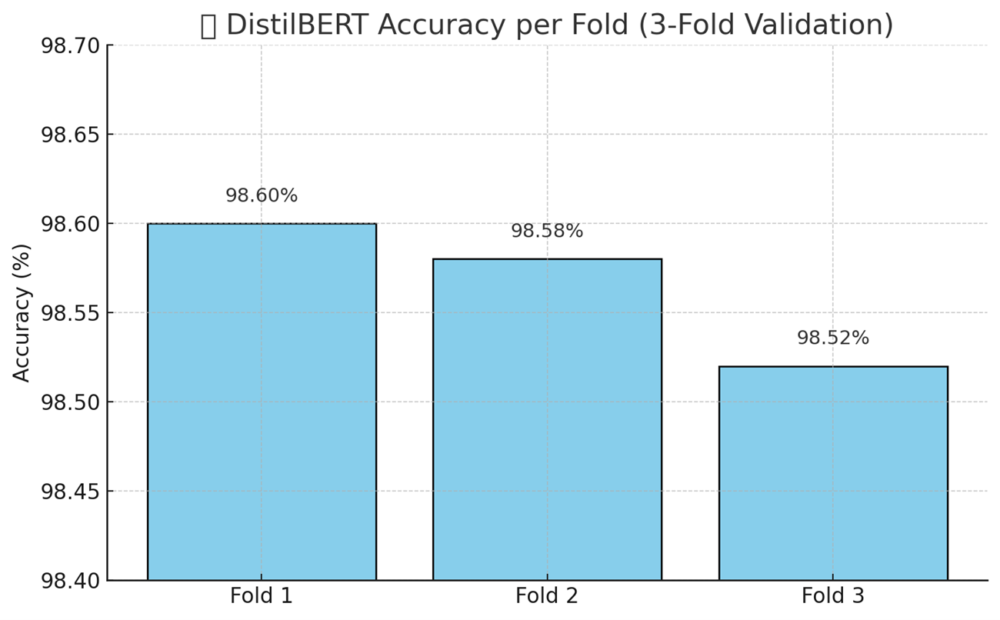
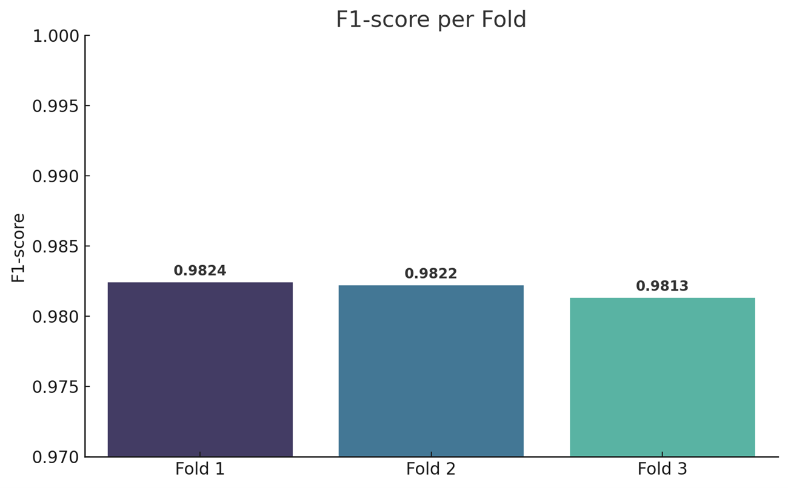

# Phishing Email Payload Detection using DistilBERT

This repository contains a clean, GitHub-ready Python implementation for phishing email/payload detection using DistilBERT, adversarial-style text augmentation, CLS embeddings, and classical machine learning classifiers.

The project is designed for cybersecurity threat detection, especially phishing email identification and malicious email payload analysis.

---

## Main File

```bash
phishing_email_detection_distilbert.py
```

---

## Project Objective

Phishing emails are commonly used for credential theft, malware delivery, financial fraud, and social engineering attacks.

The objective of this project is to classify email text as:

- `Safe Email`
- `Phishing Email`

using transformer-based NLP and machine learning techniques.

---

## Dataset

Dataset used:

```text
zefang-liu/phishing-email-dataset
```

The dataset is loaded from Hugging Face.

Labels are mapped as:

| Original Label | Encoded Label |
|---|---:|
| Safe Email | 0 |
| Phishing Email | 1 |

---

## Methodology

The project supports two approaches:

### 1. Fine-tuned DistilBERT

A DistilBERT sequence classification model is fine-tuned for binary phishing email detection.

### 2. DistilBERT CLS Embeddings + Classical ML

DistilBERT CLS embeddings are extracted from email text and used with multiple classical ML classifiers:

- Logistic Regression
- Random Forest
- Gradient Boosting
- AdaBoost
- Gaussian Naive Bayes
- SVM
- KNN
- Decision Tree

---

## Adversarial-Style Text Augmentation

The project applies basic adversarial-style text augmentation using:

- Synonym swapping
- Phishing trigger words such as:
  - `verify now`
  - `click here`
  - `urgent`
  - `confirm account`

To reduce leakage risk, the cleaned implementation splits the original dataset first and applies augmentation only to the training split.

---

## Quick Usage

Install dependencies:

```bash
pip install -r requirements.txt
```

Print documented original notebook results only:

```bash
python phishing_email_detection_distilbert.py --mode reported
```

Run DistilBERT embeddings + classical ML benchmark:

```bash
python phishing_email_detection_distilbert.py --mode embeddings
```

Fine-tune DistilBERT:

```bash
python phishing_email_detection_distilbert.py --mode finetune --epochs 2
```

---

## Reported Original Notebook Results

The fine-tuned DistilBERT model achieved the following results in the original notebook evaluation:

| Metric | Score |
|---|---:|
| Accuracy | 98.52% |
| Precision | 96.84% |
| Recall | 99.49% |
| F1-score | 98.14% |
| ROC-AUC | 0.9993 |

---

## Result Visualizations

### Class Distribution


### DistilBERT Confusion Matrix



### DistilBERT ROC-AUC Curve



### DistilBERT Training Loss Over Time



### Model Accuracy Comparison



### Classical ML ROC-AUC Comparison



---

## Cross-Validation Visualizations

### DistilBERT Accuracy per Fold



### DistilBERT F1-score per Fold



### DistilBERT ROC-AUC per Fold


---

## Security Relevance

This project is relevant to cybersecurity and AI security because phishing emails are a major attack vector for:

- Credential theft
- Social engineering
- Malware delivery
- Financial fraud
- Account takeover attempts

The project demonstrates how transformer-based NLP models and ML classifiers can support automated phishing email detection and threat monitoring.

---

## Tools and Technologies

- Python
- PyTorch
- Hugging Face Transformers
- Hugging Face Datasets
- DistilBERT
- scikit-learn
- pandas
- NumPy
- NLTK
- Matplotlib
- ROC-AUC evaluation
- Confusion matrix analysis

---

## Limitations

The reported results are based on the original notebook evaluation. Real-world phishing emails may vary across language, writing style, domain context, attacker behavior, and obfuscation techniques.

Future improvements:

- Use external phishing email test datasets
- Add URL and domain-level features
- Add explainability using SHAP or LIME
- Deploy as a Streamlit or FastAPI phishing detection tool
- Add live email text prediction interface
- Add multilingual phishing email detection

---


